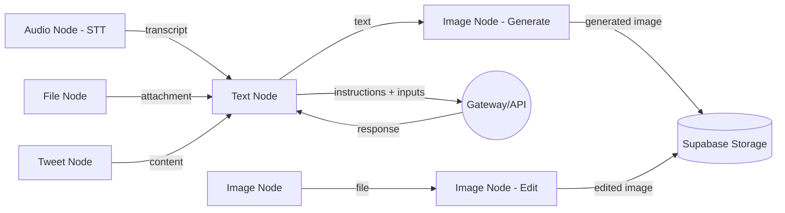
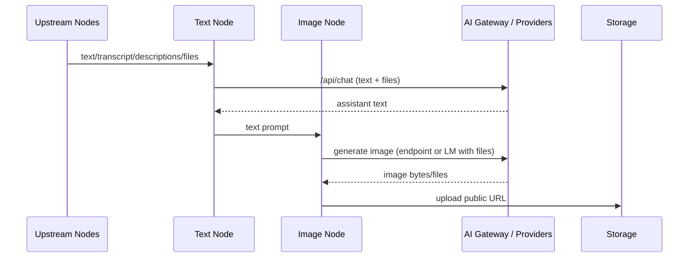

# Easel Node Development Guide

## SYNOPSIS
This document provides comprehensive guidance for creating and customizing nodes in Hustle-Tersa, including their architecture, modes (transform/primitive), UI integration, and data flow mechanisms. This guide aligns with the tool authoring standards defined in the agent-chat-tool-integration.md document to ensure complete integration between nodes and AI agent capabilities.

## REFERENCES
- [React Flow Documentation](https://reactflow.dev/learn) - Official documentation for the node flow system
- [Vercel AI SDK Documentation](https://ai-sdk.dev/docs/introduction) - Reference for the AI SDK used for agent integration
- [Agent Chat Tool Integration](./agent-chat-tool-integration.md) - Master reference for AI tool standards and implementation

## Table of Contents

1. [Node Architecture Overview](#node-architecture-overview)
2. [Creating a New Node](#creating-a-new-node)
3. [Node Modes](#node-modes)
4. [Registering & UI Integration](#registering--ui-integration)
5. [Data Flow Between Nodes](#data-flow-between-nodes)
6. [WebRendererNode: A Case Study](#webrenderernode-a-case-study)
7. [Best Practices](#best-practices)
8. [Troubleshooting](#troubleshooting)

## Node Architecture Overview

Easel uses a flow-based programming model where each node represents a specific functionality. The application is built on top of the React Flow (XYFlow) library, which provides the canvas and connection functionality.

### Core Components

Each node in Easel consists of three main components:

1. **Index Component**: The entry point that determines which mode to render
2. **Transform Component**: Handles processing of inputs and generating outputs
3. **Primitive Component**: Allows direct user input without connections

### Directory Structure

A typical node follows this directory structure:

```
components/nodes/[node-type]/
  ├── index.tsx       # Main entry point
  ├── transform.tsx   # Transform mode implementation
  └── primitive.tsx   # Primitive mode implementation
```

## Creating a New Node

Creating a new node involves defining its components, registering it with the application, and adding it to the UI. Follow these steps:

### 1. Create the Directory Structure

```bash
mkdir -p components/nodes/your-node-name
```

### 2. Create the Node Type Definition

Create an `index.tsx` file that exports the node type and props:

```tsx
// components/nodes/your-node-name/index.tsx
import type { JSONContent } from '@tiptap/core';
import { YourNodePrimitive } from './primitive';
import { YourNodeTransform } from './transform';

export type YourNodeProps = {
  type: string;
  data: {
    source: 'primitive' | 'transform';
    generated?: {
      // Define your generated output structure here
      content: string;
      // Add other output fields as needed
    };
    // Add input fields specific to your node
    model?: string;
    updatedAt?: string;
    instructions?: string;
    // Add other configuration fields
  };
};

export const YourNode = (props: YourNodeProps) => {
  const { data } = props;

  if (data.source === 'primitive') {
    return <YourNodePrimitive {...props} title="Your Node" />;
  }

  return <YourNodeTransform {...props} title="Your Node" />;
};
```

### 3. Create the Primitive Component

Create a `primitive.tsx` file for the direct input mode:

```tsx
// components/nodes/your-node-name/primitive.tsx
import { NodeLayout } from '@/components/nodes/layout';
import { Button } from '@/components/ui/button';
import { Textarea } from '@/components/ui/textarea';
import { useReactFlow } from '@xyflow/react';
import { useState, type ChangeEventHandler, type ComponentProps } from 'react';
import type { YourNodeProps } from '.';

type YourNodePrimitiveProps = YourNodeProps & {
  title: string;
};

export const YourNodePrimitive = ({
  data,
  id,
  type,
  title,
}: YourNodePrimitiveProps) => {
  const { updateNodeData } = useReactFlow();
  
  // Add your state variables here
  const [content, setContent] = useState(data.content || '');

  // Handle user input changes
  const handleContentChange: ChangeEventHandler<HTMLTextAreaElement> = (event) => {
    setContent(event.target.value);
    updateNodeData(id, { content: event.target.value });
  };

  // Create toolbar with node actions
  const createToolbar = (): ComponentProps<typeof NodeLayout>['toolbar'] => {
    const toolbar: ComponentProps<typeof NodeLayout>['toolbar'] = [];

    toolbar.push({
      children: (
        <div className="flex items-center gap-2 px-2">
          <YourNodeIcon className="h-4 w-4" />
          <span className="text-xs font-medium">Your Node</span>
        </div>
      ),
    });

    // Add toolbar items
    toolbar.push({
      tooltip: 'Save',
      children: (
        <Button
          size="icon"
          className="rounded-full"
          onClick={() => updateNodeData(id, { content })}
        >
          <SaveIcon size={12} />
        </Button>
      ),
    });

    return toolbar;
  };

  return (
    <NodeLayout id={id} data={data} title={title} type={type} toolbar={createToolbar()}>
      <div className="flex flex-col gap-2">
        {/* Add your UI components here */}
        <Textarea
          value={content}
          onChange={handleContentChange}
          placeholder="Enter your content here..."
          className="min-h-[100px] resize-none"
        />
      </div>
    </NodeLayout>
  );
};
```

### 4. Create the Transform Component

Create a `transform.tsx` file for processing inputs from other nodes:

```tsx
// components/nodes/your-node-name/transform.tsx
// ... (rest of the existing transform.tsx example code)
```

(The rest of the detailed explanation for the transform component, including `handleGenerate`, API calls, etc., should follow here, as it was originally structured.)

### 5. Register the Node Type

For Easel to recognize and use your new node, you need to register it in the central node type registry.

- Navigate to `components/nodes/index.tsx`.
- Import your main node component (e.g., `YourNode` from `components/nodes/your-node-name/index.tsx`).
- Add it to the `nodeTypes` object with a unique key that will be used to identify this node type internally and when saving/loading workflows.

```tsx
// components/nodes/index.tsx
import { ImageNode } from './image';
import { TextNode } from './text';
// ... other node imports
import { YourNode } from './your-node-name'; // <-- Import your new node

export const nodeTypes = {
  image: ImageNode,
  text: TextNode,
  // ... other nodes
  yourNodeKey: YourNode, // <-- Add your new node here
};
```

Choose a concise and descriptive `yourNodeKey` (e.g., `webRenderer`, `codeInterpreter`).

### 6. Add Node to UI Toolbar

To make your new node accessible from the UI toolbar, you need to add a button for it.

- Navigate to `lib/node-buttons.ts`.
- Import an appropriate icon for your node from `lucide-react` or provide a custom SVG icon.
- Add a new object to the `nodeButtons` array.

```ts
// lib/node-buttons.ts
import {
  ImageIcon,
  TypeIcon,
  CpuIcon,
  SearchIcon,
  MessageSquareIcon,
  SlidersIcon,
  WaypointsIcon,
  BotIcon,
  // ... other icon imports
  YourNodeIcon, // <-- Import an icon for your node (e.g., from lucide-react)
} from 'lucide-react';

export const nodeButtons = [
  // ... other button definitions
  {
    id: 'yourNodeKey', // <-- Must match the key used in nodeTypes
    label: 'Your Node Name', // <-- Display name for the tooltip
    icon: YourNodeIcon, // <-- Icon component
    data: { source: 'primitive' }, // <-- Initial data for the node when added
  },
];
```

- **`id`**: This should exactly match the key you used when registering the node in `nodeTypes`.
- **`label`**: The text that appears in the tooltip for the button.
- **`icon`**: The React component for the icon.
- **`data`**: The initial `data` object that your node will receive when it's dragged onto the canvas from the toolbar. Typically, `source: 'primitive'` is a good default if your node supports a primitive mode.

After these steps, your new node should be usable within the Easel application.

```tsx
// components/nodes/your-node-name/transform.tsx
import { NodeLayout } from '@/components/nodes/layout';
import { Button } from '@/components/ui/button';
import { Skeleton } from '@/components/ui/skeleton';
import { Textarea } from '@/components/ui/textarea';
import { useAnalytics } from '@/hooks/use-analytics';
import { handleError } from '@/lib/error/handle';
import { getTextFromTextNodes } from '@/lib/xyflow';
import { getIncomers, useReactFlow } from '@xyflow/react';
import { PlayIcon, RotateCcwIcon, SquareIcon } from 'lucide-react';
import { useParams } from 'next/navigation';
import { useState, type ChangeEventHandler, type ComponentProps } from 'react';
import { toast } from 'sonner';
import type { YourNodeProps } from '.';

type YourNodeTransformProps = YourNodeProps & {
  title: string;
};

export const YourNodeTransform = ({
  data,
  id,
  type,
  title,
}: YourNodeTransformProps) => {
  const { updateNodeData, getNodes, getEdges } = useReactFlow();
  const { projectId } = useParams();
  const analytics = useAnalytics();
  const [isLoading, setIsLoading] = useState(false);
  const [error, setError] = useState<string | null>(null);

  const handleGenerate = async () => {
    try {
      setIsLoading(true);
      setError(null);

      // Get inputs from connected nodes
      const incomers = getIncomers({ id }, getNodes(), getEdges());
      const textPrompts = getTextFromTextNodes(incomers);

      // Validate inputs
      if (!textPrompts.length && !data.instructions) {
        setError('No input provided');
        return;
      }

      // Track analytics
      analytics.track('canvas', 'node', 'generate', {
        type,
        model: 'your-node',
        instructionsLength: data.instructions?.length ?? 0,
      });

      // Process the inputs
      // Add your processing logic here
      const result = "Processed content based on inputs";

      // Update the node data with the generated content
      updateNodeData(id, {
        generated: {
          content: result,
        },
        updatedAt: new Date().toISOString(),
      });

      toast.success('Content generated successfully');
    } catch (err) {
      const errorMessage = err instanceof Error ? err.message : 'Unknown error';
      handleError('Error generating content', errorMessage);
      setError(errorMessage);
    } finally {
      setIsLoading(false);
    }
  };

  const handleInstructionsChange: ChangeEventHandler<HTMLTextAreaElement> = (
    event
  ) => updateNodeData(id, { instructions: event.target.value });

  const createToolbar = (): ComponentProps<typeof NodeLayout>['toolbar'] => {
    const toolbar: ComponentProps<typeof NodeLayout>['toolbar'] = [];

    toolbar.push({
      children: (
        <div className="flex items-center gap-2 px-2">
          <YourNodeIcon className="h-4 w-4" />
          <span className="text-xs font-medium">Your Node</span>
        </div>
      ),
    });

    if (isLoading) {
      toolbar.push({
        tooltip: 'Stop',
        children: (
          <Button
            size="icon"
            className="rounded-full"
            onClick={() => setIsLoading(false)}
            disabled={!projectId}
          >
            <SquareIcon size={12} />
          </Button>
        ),
      });
    } else if (data.generated?.content) {
      toolbar.push({
        tooltip: 'Regenerate',
        children: (
          <Button
            size="icon"
            className="rounded-full"
            onClick={handleGenerate}
            disabled={!projectId}
          >
            <RotateCcwIcon size={12} />
          </Button>
        ),
      });
    } else {
      toolbar.push({
        tooltip: 'Generate',
        children: (
          <Button
            size="icon"
            className="rounded-full"
            onClick={handleGenerate}
            disabled={!projectId}
          >
            <PlayIcon size={12} />
          </Button>
        ),
      });
    }

    return toolbar;
  };

  return (
    <NodeLayout
      id={id}
      data={data}
      title={title}
      type={type}
      toolbar={createToolbar()}
    >
      <div className="flex flex-col gap-2">
        {/* Content display area */}
        <div className="nowheel max-h-[30rem] flex-1 overflow-auto rounded-t-3xl rounded-b-xl bg-secondary p-4">
          {isLoading && (
            <div className="flex flex-col gap-2">
              <Skeleton className="h-4 w-60 animate-pulse rounded-lg" />
              <Skeleton className="h-4 w-40 animate-pulse rounded-lg" />
              <Skeleton className="h-4 w-50 animate-pulse rounded-lg" />
            </div>
          )}
          {error && !isLoading && (
            <div className="text-destructive text-sm">
              Error: {error}
            </div>
          )}
          {data.generated?.content && !isLoading && !error && (
            <div>
              {data.generated.content}
            </div>
          )}
          {!data.generated?.content && !isLoading && !error && (
            <div className="flex aspect-video w-full items-center justify-center bg-secondary">
              <p className="text-muted-foreground text-sm">
                Press <PlayIcon size={12} className="-translate-y-px inline" />{' '}
                to generate content
              </p>
            </div>
          )}
        </div>
        
        {/* Instructions input */}
        <Textarea
          value={data.instructions ?? ''}
          onChange={handleInstructionsChange}
          placeholder="Enter instructions (optional)"
          className="shrink-0 resize-none rounded-none border-none bg-transparent! shadow-none focus-visible:ring-0"
        />
      </div>
    </NodeLayout>
  );
};
```

### 5. Create an Icon for Your Node

Add an icon for your node in `lib/icons.tsx`:

```tsx
// lib/icons.tsx (add to existing file)
export const YourNodeIcon = (props: React.SVGProps<SVGSVGElement>) => (
  <svg
    xmlns="http://www.w3.org/2000/svg"
    viewBox="0 0 24 24"
    fill="none"
    stroke="currentColor"
    strokeWidth="2"
    strokeLinecap="round"
    strokeLinejoin="round"
    {...props}
  >
    {/* Add your SVG path here */}
    <circle cx="12" cy="12" r="10" />
    <path d="M12 8v8" />
    <path d="M8 12h8" />
  </svg>
);
```

### 6. Register Your Node Type

Add your node to the node types in `components/nodes/index.tsx`:

```tsx
// components/nodes/index.tsx (update existing file)
import { AudioNode } from './audio';
import { CodeNode } from './code';
import { DropNode } from './drop';
import { FileNode } from './file';
import { ImageNode } from './image';
import { TextNode } from './text';
import { TweetNode } from './tweet';
import { VideoNode } from './video';
import { YourNode } from './your-node-name'; // Add this import

export const nodeTypes = {
  text: TextNode,
  image: ImageNode,
  audio: AudioNode,
  video: VideoNode,
  code: CodeNode,
  drop: DropNode,
  file: FileNode,
  tweet: TweetNode,
  'your-node-name': YourNode, // Add this line
};
```

### 7. Add Your Node to the Toolbar

Add your node to the toolbar buttons in `lib/node-buttons.ts`:

```tsx
// lib/node-buttons.ts (update existing file)
import { YourNodeIcon } from './icons'; // Add this import

export const nodeButtons = [
  // Existing buttons
  {
    id: 'text',
    label: 'Text',
    icon: TextIcon,
  },
  // ... other buttons
  {
    id: 'your-node-name',
    label: 'Your Node',
    icon: YourNodeIcon,
    data: {
      // Default configuration for your node
    },
  },
];
```

### 8. Add Data Extraction Function

Add a function to extract data from your node in `lib/xyflow.ts`:

```tsx
// lib/xyflow.ts (update existing file)
import type { YourNodeProps } from '@/components/nodes/your-node-name';

// Add this function
export const getContentFromYourNodes = (nodes: Node[]) => {
  const contents = nodes
    .filter((node) => node.type === 'your-node-name' && node.data.generated)
    .map((node) => {
      const data = node.data as YourNodeProps['data'];
      if (data.generated?.content) {
        return data.generated.content;
      }
      return null;
    })
    .filter(Boolean) as string[];

  return contents;
};
```

Then update other nodes (like the Text node) to use this function:

```tsx
// components/nodes/text/transform.tsx
import { getContentFromYourNodes } from '@/lib/xyflow';

// In the handleGenerate function
const yourNodeContent = getContentFromYourNodes(incomers);

// Add to content array
if (yourNodeContent.length) {
  content.push('--- Content from Your Node ---', ...yourNodeContent);
}
```

## Node Modes

Easel nodes automatically operate in two distinct modes based on their connections:

### Primitive Mode

**Purpose**: Allows users to directly input data without requiring connections from other nodes.

**Characteristics**:
- Self-contained with its own input controls
- No incoming connections
- Acts as a data source for the flow
- Typically used at the beginning of a flow

**Implementation**:
- Defined in the `primitive.tsx` file
- Rendered when there are no incoming connections
- Uses `useNodeConnections()` to detect connection state
- Provides UI for direct user input

### Transform Mode

**Purpose**: Processes data from incoming connections and transforms it.

**Characteristics**:
- Has one or more incoming connections
- Processes data from connected nodes
- Outputs transformed data
- Can be chained with other nodes

**Implementation**:
- Defined in the `transform.tsx` file
- Rendered when there are incoming connections
- Automatically switches based on `useNodeConnections()` hook
- Retrieves data from connected nodes using `getIncomers()`

**Mode Detection Pattern**:
```tsx
const connections = useNodeConnections({
  id: props.id,
  handleType: 'target',
});
const Component = connections.length ? Transform : Primitive;
```

## Data Flow Between Nodes

Nodes in Easel communicate by passing data through connections. Understanding how this data flows is crucial for building effective workflows.

### Receiving Input Data

When a node (let's call it the 'consumer node') is connected to another node (the 'producer node'), the consumer node can access the output data of the producer node.

- **Accessing Incomers:** Inside your node's component (typically the `transform.tsx`), you can use the `getIncomers` function from `@xyflow/react` (along with `getNodes` and `getEdges`) to get an array of all directly connected input nodes.

  ```tsx
  import { getIncomers, useReactFlow } from '@xyflow/react';
  
  // Inside your component
  const { getNodes, getEdges } = useReactFlow();
  const incomers = getIncomers({ id: props.id }, getNodes(), getEdges());
  ```

- **Accessing Producer Node Data:** Each `incomer` in the array is a standard `Node` object. The data generated by the producer node is typically stored within its `data` property. A common convention in Easel is to store generated output in a `generated` object within `data`.

  For example, if a `CodeNode` produces HTML content, it might store it in `incomerNode.data.generated.text`.

  ```tsx
  // Example: Iterating through incomers to find specific data
  let htmlInput = '';
  for (const incomerNode of incomers) {
    if (incomerNode.type === 'code' && incomerNode.data?.generated?.text) {
      htmlInput = incomerNode.data.generated.text;
      break; 
    }
    // You might also look for other types of data from other node types
  }
  ```

- **Utility Functions:** Easel provides helper functions like `getTextFromTextNodes` (in `lib/xyflow.ts`) to simplify extracting common data types from an array of incomers. You can create similar utilities for your specific data needs.

### Consuming Output from Multiple Node Types

Often, a node might need to process similar types of data (e.g., textual context, URLs, or structured data) that can originate from various source nodes. For instance, a `CodeNode` might want to use textual context from a `TextNode` (user-inputted text) or from a `FirecrawlNode` (scraped web content).

To handle this in a clean, maintainable, and scalable way, Easel employs a pattern of using specialized helper functions located in `lib/xyflow.ts`.

**The Pattern:**

1.  **Identify the Need:** A consumer node (e.g., `CodeNode`) needs to accept a certain kind of data (e.g., "any textual content").
2.  **Create a Generalized Helper:** A function is created in `lib/xyflow.ts` (e.g., `getMarkdownOrTextContentFromNodes`). This function takes the array of `incomers` as input.
3.  **Helper Logic:** Inside the helper, it iterates through the `incomers`:
    *   It checks the `type` of each `incomer` node.
    *   Based on the `type`, it knows where to find the relevant data within that node's `data` object (e.g., for `type: 'text'`, it looks at `data.text` or `data.generated.text`; for `type: 'firecrawl'`, it looks at `data.generated.markdown` or `data.generated.content`).
    *   It collects all relevant data into a unified format, typically an array of strings or a consistent object structure.
4.  **Consumer Node Usage:** The consumer node then calls this single helper function to get all relevant data from its connected inputs, without needing to know the specific details of each producer node type.

**Example: `CodeNode` and `getMarkdownOrTextContentFromNodes`**

Previously, the `CodeNode` used `getTextFromTextNodes` to gather context, meaning it could only use output from `TextNode`s. To allow it to also consume scraped content from `FirecrawlNode`s:

1.  The `getMarkdownOrTextContentFromNodes` helper was created in `lib/xyflow.ts`. This function:
    *   Extracts text from `TextNode`s (both `data.text` and `data.generated.text`).
    *   Extracts content from `FirecrawlNode`s (prioritizing `data.generated.markdown`, then `data.generated.content`).
    *   Returns a combined array of strings.
2.  The `CodeNode`'s `transform.tsx` was updated to import and use `getMarkdownOrTextContentFromNodes` instead of `getTextFromTextNodes`. This allows it to seamlessly use textual input from both `TextNode`s and `FirecrawlNode`s as context for AI code generation.

**Benefits of this Approach:**

*   **Decoupling:** Consumer nodes don't need to be hardcoded to understand the internal data structure of every possible producer node. They rely on the helper function's "contract."
*   **Maintainability:** If a producer node changes how it stores its output, only the relevant part of the helper function in `lib/xyflow.ts` needs to be updated. All consumer nodes using that helper will continue to work correctly.
*   **Scalability:** When new producer nodes are added that provide a similar type of data, the generalized helper function can be easily extended to support them. Consumer nodes will then automatically benefit without requiring individual modifications.
*   **Clarity:** The data-gathering logic is centralized in `lib/xyflow.ts`, making the transform components of individual nodes cleaner and more focused on their core processing tasks.

This pattern is recommended when designing nodes that need to flexibly consume data from an evolving set of input sources.

### Structuring Output Data

When your node processes inputs and generates an output, you should store this output within the node's `data` object so that downstream nodes can access it.

- **Using `updateNodeData`:** The `updateNodeData` function from `useReactFlow` is used to update a node's internal data.

  ```tsx
  const { updateNodeData } = useReactFlow();
  
  // Inside a function that generates output
  const generatedOutput = { text: "Some processed text", value: 123 };
  updateNodeData(props.id, { 
    generated: generatedOutput,
    // You can also update other parts of 'data' as needed
    lastRun: new Date().toISOString(),
  });
  ```

- **Convention for `generated`:** Storing primary outputs in a `data.generated` object is a good practice. This keeps the `data` object organized, especially if your node also has configuration or state properties within `data`.

### Example: `WebRendererNode`

The `WebRendererNode` (detailed in the case study below) is a good example of a consumer node. It looks for an incomer (typically a `CodeNode`) and expects to find HTML content in `incomerNode.data.generated.text` to render in its `iframe`.

### Input Collection

Nodes receive inputs through:

1. **Direct User Input**: In primitive mode, users directly enter data through the UI
2. **Node Connections**: In transform mode, data flows from connected nodes

The input handling is implemented in the `handleGenerate` function within the transform component:

```typescript
const handleGenerate = async () => {
  // Get input from connected nodes
  const incomers = getIncomers({ id }, getNodes(), getEdges());
  const textPrompts = getTextFromTextNodes(incomers);
  
  // Process the input...
};
```

### Output Storage

Nodes output data through:

1. **Node Data**: The processed data is stored in the node's data object
2. **Connections**: Other nodes can connect to this node and access its data

The output is typically stored in the `generated` field of the node data:

```typescript
updateNodeData(id, {
  generated: {
    content: result,
    // Other output fields
  },
  updatedAt: new Date().toISOString(),
});
```

### Data Extraction

To make your node's output available to other nodes, you need to create an extraction function in `lib/xyflow.ts`:

```typescript
export const getContentFromYourNodes = (nodes: Node[]) => {
  const contents = nodes
    .filter((node) => node.type === 'your-node-name' && node.data.generated)
    .map((node) => {
      const data = node.data as YourNodeProps['data'];
      if (data.generated?.content) {
        return data.generated.content;
      }
      return null;
    })
    .filter(Boolean) as string[];

  return contents;
};
```

Then update other nodes (like the Text node) to use this function:

```typescript
// In the Text node's handleGenerate function
const yourNodeContent = getContentFromYourNodes(incomers);

// Add to content array
if (yourNodeContent.length) {
  content.push('--- Content from Your Node ---', ...yourNodeContent);
}
```

## Registering & UI Integration

(This section is now covered within the 'Creating a New Node' steps 5 and 6. The Table of Contents has been updated.)

### Node Layout

All nodes use the `NodeLayout` component which provides:
- Consistent styling
- Toolbar functionality
- Context menu integration
- Selection handling

```tsx
<NodeLayout
  id={id}
  data={data}
  title={title}
  type={type}
  toolbar={createToolbar()}
>
  {/* Node content */}
</NodeLayout>
```

### Toolbar

The toolbar provides actions for the node:

```tsx
const createToolbar = (): ComponentProps<typeof NodeLayout>['toolbar'] => {
  const toolbar: ComponentProps<typeof NodeLayout>['toolbar'] = [];

  // Add toolbar items
  toolbar.push({
    children: (
      <div className="flex items-center gap-2 px-2">
        <YourNodeIcon className="h-4 w-4" />
        <span className="text-xs font-medium">Your Node</span>
      </div>
    ),
  });

  // Add generate/regenerate button
  toolbar.push({
    tooltip: 'Generate',
    children: (
      <Button
        size="icon"
        className="rounded-full"
        onClick={handleGenerate}
      >
        <PlayIcon size={12} />
      </Button>
    ),
  });

  return toolbar;
};
```

### Adding to the Bottom Menu

To add your node to the bottom toolbar, update `lib/node-buttons.ts`:

```tsx
export const nodeButtons = [
  // Existing buttons
  {
    id: 'your-node-name',
    label: 'Your Node',
    icon: YourNodeIcon,
    data: {
      // Default configuration
    },
  },
];
```


## Available Node Types in Tersa

Easel includes several built-in node types, each designed for specific content types and workflows:

### Text Node (`components/nodes/text/`)
- **Purpose**: Text input and AI-powered text generation
- **Modes**: Both primitive (direct text input using TipTap editor) and transform (AI text generation)
- **Key Features**: Rich text editing, AI model selection, instructions support, reasoning capabilities
- **Data Structure**: Supports both `content` (TipTap JSON) and `text` (plain text), plus `generated.text`

### Image Node (`components/nodes/image/`)
- **Purpose**: Image upload, generation, and editing
- **Modes**: Both primitive (image upload) and transform (AI image generation/editing)
- **Key Features**: Multiple AI providers, size selection, image descriptions
- **Data Structure**: `content.url` for uploads, `generated.url` for AI-generated images

### Code Node (`components/nodes/code/`)
- **Purpose**: Code input and AI-powered code generation
- **Modes**: Both primitive (manual code entry) and transform (AI code generation)
- **Key Features**: Syntax highlighting, language selection, AI model integration
- **Data Structure**: `content.text` and `content.language` for input, `generated` for AI output

### Audio Node (`components/nodes/audio/`)
- **Purpose**: Audio file handling, speech synthesis, and transcription
- **Modes**: Both primitive (audio upload) and transform (AI speech generation)
- **Key Features**: Voice selection (OpenAI, LMNT, Hume), transcription capabilities
- **Data Structure**: `content.url` for uploads, `generated.url` for synthesis, `transcript` for transcription

### Video Node (`components/nodes/video/`)
- **Purpose**: Video file handling and AI video generation
- **Modes**: Both primitive (video upload) and transform (AI video generation)
- **Key Features**: Multiple video AI providers (Luma, Minimax, Runway, Replicate)
- **Data Structure**: `content.url` for uploads, `generated.url` for AI-generated videos

### File Node (`components/nodes/file/`)
- **Purpose**: Generic file upload and management
- **Modes**: Primitive only (file upload interface)
- **Key Features**: File type detection, download capabilities
- **Data Structure**: `content.url`, `content.name`, `content.type`

### Tweet Node (`components/nodes/tweet/`)
- **Purpose**: Twitter/X content integration
- **Modes**: Primitive only (tweet ID input and display)
- **Key Features**: Tweet content extraction and display
- **Data Structure**: `content.id`, `content.text`, `content.author`, `content.date`

### Drop Node (`components/nodes/drop.tsx`)
- **Purpose**: Special node for adding new nodes to the canvas
- **Features**: Command palette interface, auto-cleanup, keyboard shortcuts (Escape to close)
- **Usage**: Appears when connecting nodes or using the "+" button

### Node Architecture Patterns

All nodes (except File, Tweet, and Drop) follow these patterns:

1. **Automatic Mode Switching**: Use `useNodeConnections()` to detect connections and switch between primitive/transform modes
2. **Consistent Data Structure**: `data.content` for user input, `data.generated` for AI output, `data.instructions` for AI prompts
3. **Model Integration**: AI-powered nodes integrate with the gateway system for model selection
4. **Toolbar Pattern**: Generate/Regenerate buttons, model selectors, timestamp indicators
5. **Error Handling**: Toast notifications, loading states, and error recovery


## Best Practices

### 1. Node Design

- **Clear Purpose**: Each node should have a single, well-defined purpose
- **Intuitive UI**: Make the node's functionality clear through its UI
- **Consistent Styling**: Follow the existing design patterns
- **Error Handling**: Provide clear error messages and fallbacks

### 2. Data Flow

- **Explicit Inputs**: Clearly define what inputs your node accepts
- **Structured Outputs**: Format your outputs consistently
- **Data Validation**: Validate inputs before processing
- **Extraction Functions**: Create functions to make your node's data available to others

### 3. Performance

- **Async Processing**: Use async/await for long-running operations
- **Loading States**: Show loading indicators during processing
- **Cancelation**: Allow users to cancel operations
- **Efficient Updates**: Only update node data when necessary

### 4. Integration

- **Register Node Types**: Add your node to the nodeTypes object
- **Add to Toolbar**: Add your node to the nodeButtons array
- **Create Extraction Functions**: Add functions to extract data from your node
- **Update Other Nodes**: Ensure other nodes can use your node's output

## Troubleshooting

### Common Issues

1. **Node Not Appearing in Toolbar**
   - Check if your node is properly registered in `nodeTypes`
   - Verify that your node is added to `nodeButtons`

2. **Data Not Flowing Between Nodes**
   - Ensure you've created an extraction function in `lib/xyflow.ts`
   - Check that other nodes are using your extraction function
   - Verify that your node is storing data in the expected format

3. **UI Not Rendering Correctly**
   - Check for CSS issues in your component
   - Ensure you're using the `NodeLayout` component correctly
   - Verify that your toolbar is properly configured

4. **Node Not Processing Data**
   - Check for errors in your `handleGenerate` function
   - Verify that you're correctly retrieving data from connected nodes
   - Ensure you're updating the node data with the processed results

### Debugging Tips

1. **Console Logging**: Add console logs to track data flow
2. **React DevTools**: Use React DevTools to inspect component props and state
3. **Network Monitoring**: Check network requests if your node makes API calls
4. **Error Boundaries**: Add error boundaries to catch and display errors

## Conclusion

Creating nodes in Easel follows a consistent pattern that allows for powerful and flexible data processing. By following this guide, you can create nodes that integrate seamlessly with the existing system and provide valuable functionality to users.

Remember to test your nodes thoroughly and ensure they work well with other nodes in the system. With proper design and implementation, your nodes can become powerful tools in the Easel ecosystem.

# Base Technical Foundation — Nodes, Tools, and Data Flow

[Read first: Getting Started guide](./getting-started.md)

## Table of Contents
- Overview
- Core Concepts
  - Nodes and Edges (XYFlow)
  - Tools and Providers (AI SDK + Gateway)
  - Credits and Usage
- Node Types and Behaviors
  - Text Node
  - Image Node (Generate & Edit)
  - Audio: Speech (TTS) and Transcription (STT)
  - Video Node
  - File Node
  - Tweet Node
- Prompt Assembly and Multimodal Inputs
- Execution Flow (Sequential/Parallel)
- Persistence and Storage
- Extending the System
  - Add a Model
  - Add a Tool
  - Add a Node
- Troubleshooting

## Overview
“Base Technical Foundation” (BTF) is the architecture that powers the canvas. It combines:
- XYFlow for controlled graph state (nodes/edges)
- Vercel AI SDK + Gateway for model execution
- Supabase for auth, storage, and persistence
- Stripe for credits/metering

The canvas is a controlled graph: your actions produce a deterministic, serializable `{ nodes, edges }` model. Each node type standardizes how it accepts inputs, assembles prompts, calls the appropriate tool/model, and emits outputs.

## Core Concepts

### Nodes and Edges (XYFlow)
- We use `useNodesState`/`useEdgesState` in UI to keep graph controlled.
- Edges represent data flow. A node gathers all incoming nodes using `getIncomers(id, nodes, edges)` and extracts specific typed inputs (text, images, files, audio transcripts, tweets) via helpers in `lib/xyflow.ts`.
- Each node has a “primitive” (empty state / upload surface) and a “transform” (actionable state with a toolbar and actions).

### Tools and Providers (AI SDK + Gateway)
- Models are defined in `lib/models/*` registries. Each entry sets:
  - label, provider metadata, `providers[0].model`, and `getCost()` for billing
  - optional flags like `supportsEdit`, supported sizes/ratios, and `lmImage` for LM-based image output
- Chat/Code use the Vercel AI Gateway client in `lib/gateway.tsx`.
- Image/Video/Speech use AI SDK provider models or specialized SDKs; some route through Gateway.

### Credits and Usage
- We compute operation dollar cost per model via `getCost(...)`.
- Convert dollars → credits in `lib/stripe.ts` at $0.005/credit (ceil) and send meter events to Stripe.
- Remaining credits are computed via invoice preview; see `docs/billing-and-usage.md`.

## Node Types and Behaviors

### Text Node
- Gathers inputs from upstream nodes:
  - Text prompts, audio transcription, image descriptions, tweet content, file attachments
- Assembles a composite prompt:
  - `Instructions` (node-local)
  - `Text Prompts`, `Audio Prompts`, `Image Descriptions`, `Tweet Content`
- Calls `/api/chat` (Gateway-backed). Attachments become `files` for multimodal models.
- Output: assistant text (plus optional source URLs) is saved to node data.

### Image Node
- Two modes: Generate and Edit.
- Upstream inputs:
  - For Generate: Text prompts (from Text nodes) and optionally instructions/size
  - For Edit: Incoming image (file or image node) + instructions
- Providers:
  - OpenAI GPT Image 1 (Images API)
  - BFL FLUX family (image endpoint)
  - Google Gemini 2.5 Flash Image Preview via Gateway (LM emitting image files)
- Generate flow:
  - If provider is a pure image model: use `experimental_generateImage`
  - If provider is GPT Image 1: use OpenAI Images API
  - If provider `lmImage` (e.g., Gemini preview): call `generateText` with `providerOptions.google.responseModalities=['TEXT','IMAGE']` and parse `result.files`
- Edit flow:
  - If `supportsEdit` and is a pure image model: use image edit endpoint/provider options
  - For Gemini preview (LM): pass the incoming image as a `file` part in `messages[0].content` along with a `text` part; enable image output; extract file bytes
- Output: saved to Supabase `files` bucket with public URL; node data updated with url/type and updatedAt

### Audio Nodes
- Speech (TTS): `lib/models/speech.ts` defines models; cost based on characters.
- Transcription (STT): `lib/models/transcription.ts` defines models; outputs transcript text for downstream Text nodes.

### Video Node
- Uses `lib/models/video/index.ts` providers (Runway, Luma, Minimax, Replicate) with per-duration pricing.
- Saves MP4 to Supabase `files` bucket and updates node data.

### File Node
- Uploads a file to `files` bucket and exposes a public URL/mediatype; can be attached to Text nodes as multimodal input.

### Tweet Node
- Extracts tweet content for downstream Text nodes.

## Prompt Assembly and Multimodal Inputs
- Text Node composes a single message string with section headers + attaches files/URLs for multimodal models.
- Image Node Generate composes instruction + context; Edit composes instruction + input image.
- For LM-based image output (Gemini preview), the model must be called with `generateText` and image output enabled in provider options.

### Diagrams





## Persistence and Storage
- Graph `{ nodes, edges }` serialized in the project’s content.
- Images/videos stored in Supabase `files` bucket (public); URLs referenced in node data.

### Realtime collaboration (Liveblocks)
- Yjs sync is temporarily disabled while we iterate on the CRDT design.
- Liveblocks presence remains enabled for cursors, names, and avatars.
- Graph changes currently update local React state and persist to the project document on debounce.
- When CRDT sync returns, this section will be updated with the new storage model and conflict strategy.

## Extending the System

### Add a Model
- Edit the relevant registry: `lib/models/{image|video|speech|transcription}.ts`
- Provide `providers[0].model` and `getCost` (USD/op); set flags (`supportsEdit`, `lmImage`)

### Add a Tool
- For server tools, add a server action under `app/actions/...` wrapping the provider call.
- For client tools, use AI SDK React hooks and add a provider-backed model to the registry.

### Add a Node
- Create `components/nodes/<kind>/primitive.tsx` and `transform.tsx`
- Wire prompt assembly using helpers in `lib/xyflow.ts`
- Connect to registry model(s) as appropriate and update outputs to storage/db

## Troubleshooting
- “message.content is not iterable”: LM edit path requires `messages: [{ role: 'user', content: [{type:'text'},{type:'file'}] }]` (array of parts), not a plain string.
- “Unable to read image bytes …”: Provider files can be returned as data/url/blob/toArrayBuffer/arrayBuffer/base64Data/uint8ArrayData; our extraction covers all, but ensure the model is routed correctly (Gateway for Gemini preview) and responseModalities includes `IMAGE`.
- Images not rendering: verify `next.config.ts` remotePatterns includes your Supabase host.
